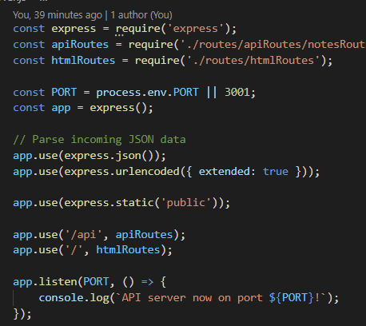

# zpl-note-taker-1

## Description

  - What was my motivation? I wanted to make a Note Taker application that allows users to add and update tasks.
  - Why did I build this project? I wanted to build the back end for this project to test my capabilities with creating GET and POST routes.
  - What problem does it solve? It solves the application not having a back-end in order to function.
  - What did I learn? I learned how to connect the back-end to the front end of an application.
  - What makes my project stand out? My application's readability is easy to follow for the apiRoutes.js file.

## Table of Contents
  
  - [Description](#description)
  - [Credits](#credits)
  - [License](#license)

## Usage

## Credits

# License

No license.
## User Story
AS A small business owner
I WANT to be able to write and save notes
SO THAT I can organize my thoughts and keep track of tasks I need to complete

## Acceptance Criteria
GIVEN a note-taking application
WHEN I open the Note Taker
THEN I am presented with a landing page with a link to a notes page

WHEN I click on the link to the notes page
THEN I am presented with a page with existing notes listed in the left-hand column, plus empty fields to enter a new note title and the note’s text in the right-hand column

WHEN I enter a new note title and the note’s text
THEN a Save icon appears in the navigation at the top of the page

WHEN I click on the Save icon
THEN the new note I have entered is saved and appears in the left-hand column with the other existing notes

WHEN I click on an existing note in the list in the left-hand column
THEN that note appears in the right-hand column

WHEN I click on the Write icon in the navigation at the top of the page
THEN I am presented with empty fields to enter a new note title and the note’s text in the right-hand column

---

## Questions?
  If you have any questions, check out my [GitHub profile](https://github.com/zachary-levin) at or email me at [zlevin706@gmail.com](mailto:zlevin706@gmail.com)
